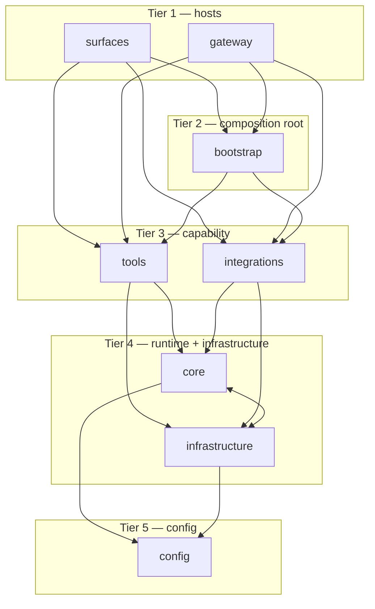
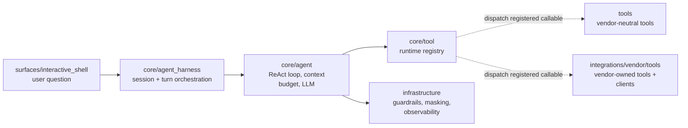
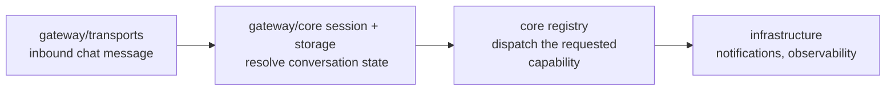

# OpenSRE architecture

How the OpenSRE codebase is structured: the eight first-party packages, what
each is responsible for, and which may depend on which. These dependency rules
are CI-enforced (`make check-imports`), so they are real invariants rather than
aspirations.

## The layer stack

The packages sit in five tiers. **Higher tiers may import lower tiers; a lower
tier may never import a higher one.** Packages on the same tier are peers — the
last column says whether peers may import each other.

| Tier | Packages | May import | Must never import | Peer rule |
| --- | --- | --- | --- | --- |
| 1 (top) | `surfaces`, `gateway` | `bootstrap`, `tools`, `integrations`, `core`, `infrastructure`, `config` | — | Independent peers; must not import each other, except three tracked CLI/REPL gateway-command edges listed in `.importlinter.strict`. |
| 2 | `bootstrap` | `tools`, `integrations`, `core`, `infrastructure`, `config` | `surfaces`, `gateway` | Composition root. The only package that may import `tools` **and** `integrations` together, because wiring needs both. |
| 3 | `tools` | `core`, `infrastructure`, `config` | `surfaces`, `gateway`, `bootstrap` | Peer of `integrations`: must not import it. Existing edges are listed as debt in `.importlinter.strict`. |
| 3 | `integrations` | `core`, `infrastructure`, `config` | `tools`, `surfaces`, `gateway`, `bootstrap` | Peer of `tools`: must not import it. |
| 4 | `core`, `infrastructure` | `config` | `surfaces`, `gateway`, `bootstrap`, `tools`, `integrations` | Siblings: **may** cross-import each other. |
| 5 (bottom) | `config` | — (nothing first-party) | everything above | Independent — imports no other first-party package. |

The shortcut: **dependencies point downward only.** A surface can reach all the
way down; `config` can reach nothing. The single deliberate exception is
`core ⟷ infrastructure`, a mutually-dependent pair by design (see below).

The arrows show edges between **adjacent** tiers to keep the diagram readable.
The actual rule is broader: a tier may import **any** tier below it, not only
the one directly beneath — so a surface may import `config` directly, and a
tool may import `infrastructure`. Refer to the "May import" column above for the
complete set of allowed edges.

## The layers in detail

### Tier 1 — `surfaces` and `gateway`

The entry points a human or an external system talks to. Nothing first-party
may import from here, so a surface can be added or removed without touching the
layers below it.

- **`surfaces/`** — one folder per UI/client: `surfaces/cli` (the stateless
  `opensre <command>` runner), `surfaces/interactive_shell` (the stateful
  REPL), and `surfaces/shared` for code two or more surfaces use. A surface
  owns its own I/O, prompts, and presentation, and composes lower layers to do
  the actual work. The two terminal surfaces are peers and do not import each
  other (`tests/shared/test_surface_border.py` pins both directions at zero);
  what both need lives in `surfaces/shared` — `terminal/` (output tracking,
  tables, prompts, banner, health and feedback rendering), `llm_setup/`,
  `error_handling/` — or a lower layer. `surfaces/entrypoint.py` is the
  `opensre` console script: it hands the CLI a `CliHost` (how to open the
  shell, how to run the gateway attached) and hands the shell the CLI's Click
  group for grounding, so composition happens in one place above both. Slack is not a surface: its inbound
  transport lives in `gateway/transports/slack`, outbound delivery in
  `integrations/slack`.
- **`gateway/`** — the standalone messaging gateway for inbound chat platforms
  (`gateway/transports/{telegram,slack,discord,buzz}`), plus the FastAPI
  `gateway/web/` surface (health, alert intake) and the
  shared per-turn machinery in `gateway/core/{session,storage,middleware}`
  (`middleware/` holds the inbound-decision, identity, and approval steps every
  transport composes). A peer of `surfaces`, not a child.

### Tier 2 — `bootstrap`

The **composition root** for process and harness wiring. Hosts (`surfaces`,
`gateway`) cannot import each other, and `tools` / `integrations` are peers that
must not import each other — yet registering harness adapters needs both
capability packages. `bootstrap/` is the only package allowed to import `tools`
**and** `integrations` together.

Every entrypoint boots through `configure_process(<profile>)` from
`bootstrap/process.py`: a profile (CLI, gateway, web, scheduler worker,
embedded) selects which boot steps run, and the step order is fixed by this
package — profiles cannot invent a different sequence. Adapter and
scheduler-runner registration lives in `bootstrap/adapters.py` and nowhere
else; surfaces and gateway used to keep peer copies — do not reintroduce them.

Host-owned concerns stay out of this package: CLI/gateway logging, Rich product
ports, CLI’s update-tolerant Sentry init.

### Tier 3 — `tools` and `integrations`

The capability layer — "do a thing against the outside world" — split by
responsibility:

- **`integrations/`** — the boundary for **user config and external clients**:
  per-vendor config normalization, verification (`verifier.py`), API clients
  (`client.py`), the store/catalog that resolves credentials, and
  integration-local helpers. One folder per vendor (`integrations/datadog`,
  `integrations/grafana`, `integrations/github`, …) plus cross-cutting pieces
  like `integrations/llm_cli`.
- **`tools/`** — the **vendor-neutral agent-callable** boundary: the registry,
  interactive-shell tool framework, `tools/system/` for capabilities with no
  vendor in their domain purpose, and the narrow `tools/cross_vendor/` bucket
  for capabilities that genuinely span vendors. A tool tied to one vendor
  belongs under `integrations/<vendor>/tools/`, beside that vendor's client and
  configuration. See [tool-placement-policy.md](tool-placement-policy.md).

`tools` and `integrations` are peers, so neither may import the other in new
code. The exceptions in `.importlinter.strict` are tracked migration debt, not
precedent: they cover the existing cross-vendor tools and a few incidental
credential/client edges. Single-vendor tools avoid the peer edge entirely by
living inside their owning `integrations/<vendor>/` package. `bootstrap`
discovers and registers both tool families into the `core.tool` registry.
Do **not** reintroduce top-level `vendors/` or `services/` packages.

### Tier 4 — `core` and `infrastructure`

The shared runtime and cross-cutting services the capability layer is built on.

- **`core/`** — the provider-agnostic agent runtime: the think → call tools →
  observe loop (`core.agent.Agent`), agent state (`core/state`) and
  context-budget enforcement (`core/context_budget.py`), tool contracts, schema,
  registry ports, execution, and error reporting (`core/tool`), tool authoring
  helpers (`core/tool_framework`),
  shared LLM clients (`core/llm`), agent-harness
  session handling (`core/agent_harness`), and pure domain rules (`core/domain`).
- **`infrastructure/`** — cross-cutting services with no agent logic of their
  own: guardrails, masking, sandbox, analytics, auth, notifications,
  observability, scheduler, deployment, and the shared **turn host**
  (`turn_host`) — the single `TurnRunner` the interactive shell and every
  gateway transport run turns through, so the two entry paths cannot drift.
  Deploy-time assets live under
  `infrastructure/deployment/` (EC2/packaging Python tooling plus the
  `cloudflare_install_proxy` edge worker); these are not imported by the app.

These two are the one bidirectional pair by design: `core` reaches `infrastructure`
for guardrails, masking, observability, and evidence/log compaction, while
`infrastructure` reaches back into `core` for the shared state and session types
(`core.state`, `core.agent_harness.session`). Splitting them into
separate tiers would forbid that edge, so they share a tier as siblings.

### Tier 5 — `config`

The floor: shared constants, prompts, and UI theme. Everything above may
read from `config`, but `config`
imports no other first-party package — keeping it a leaf means constants can be
imported anywhere without dragging runtime along.

## Cross-layer flows

Two worked examples showing runtime control flow and how results return to the
host. Dashed registry-dispatch arrows are callbacks installed by `bootstrap`;
they do not represent static imports from `core` into capability packages.

### A chat turn from the interactive shell

1. The shell (or a gateway transport) hands the message to the shared agent
   harness in `core/agent_harness` — the surface never runs agent logic itself.
2. The harness runs the ReAct agent (`core/agent`): think → call tools →
   observe, under the context budget.
3. `bootstrap` has already registered vendor-neutral tools from `tools` and
   vendor-owned tools from `integrations/<vendor>/tools` behind the registry's
   `core` contract. Dispatch through that registry is a runtime callback, not a
   forbidden `core` import of either capability package.
4. Vendor-owned tools use the client and resolved credentials in their own
   integration package; `infrastructure` supplies guardrails, masking, and
   observability around calls.
5. The answer flows back up to the surface, which owns how it is presented or
   delivered.

### An inbound gateway message

`gateway` receives a message, resolves session state from its own storage, then
uses the same boot-registered tier-3 capabilities as a surface — without ever
importing `surfaces`, since the two are independent tier-1 peers.

## Related docs

- [`AGENTS.md`](https://github.com/Tracer-Cloud/opensre/blob/main/AGENTS.md) —
  repo map and per-area "files to touch" guides.
