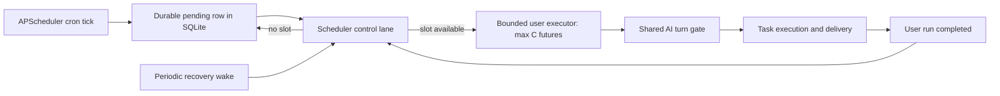

# Scheduler bounded-dispatch rollout

This runbook covers M4 and M5 of #6135. It keeps SQLite as the durable source of
truth and does not add a queue service or distributed scheduler.

## Architecture



The control lane has one lightweight thread and never performs user task work.
It only discovers durable candidates and fills free user-execution slots. User
work is submitted to the worker pool only after a slot is reserved, so the
number of in-memory user futures is bounded by
`OPENSRE_SCHEDULER_MAX_CONCURRENT_RUNS`.

## Capacity contract

The following invariants are part of the scheduler contract:

- Every admitted cron tick is persisted before execution capacity is checked.
- At most **C** user-task futures are submitted in memory, where **C** is the
  configured scheduler concurrency.
- Overflow remains as durable `pending` work in SQLite; it is not represented by
  another unbounded Python callback queue.
- Durable candidates are considered in admission order while same-task live-owner
  exclusion and claim fencing remain authoritative in SQLite.
- Worker completion wakes dispatch immediately; the periodic recovery job is a
  separate control-plane wake-up and therefore cannot be trapped behind user
  workers that are blocked on the shared turn gate.
- Existing APScheduler same-job overlap/coalescing remains a scheduler policy;
  any tick passed to the executor is persisted before a max-instance rejection.
- Recurring durable dispatch follows the scheduler's current registered-job set,
  so a filtered resync cannot keep claiming work for a task that moved to another
  scheduler owner. APScheduler date jobs retain only their admitted one-shot tick
  after the job itself is removed.
- Disabled tasks remain durable and can resume when re-enabled. Deleted schedules
  are not reported as operator backlog by `opensre cron status`.

Structured operations-log events named `scheduler_backlog_state_changed` record
only state and capacity metadata (`state`, pending count/age, active runs, and
capacity). They do not include prompts or delivered message content.

## Baseline to compare

M1/M2 is implemented by #6173. Its checked-in baseline is the authoritative
**before** dataset for this rollout. In that baseline:

- a 1,000-task burst could retain 1,000 submitted-but-unfinished executor
  callbacks at the default two-worker setting;
- sustained 100 / 200 / 300 arrivals per second observed executor pressure of
  2 / 36 / 142 callbacks;
- 10k and 100k completed-history recovery plans used the pending, expired-run,
  and live-owner indexes rather than scanning completed history; and
- 100 serial restart-recovery runs drained in about 1.15 seconds in that test
  environment, with zero recorded SQLite lock failures.

Those numbers describe the #6173 benchmark host and workload; they are not a
capacity promise for another deployment.

## M4 verification

The focused dispatcher tests must prove all of the following before merge:

1. A deterministic 1,000-task burst never exceeds **C** in-memory user futures.
2. Overflow remains durable until worker completion creates capacity.
3. A recovery control cycle runs while all **C** user workers are blocked.
4. Releasing a worker wakes dispatch without waiting for the one-minute recovery
   interval.
5. Same-task exclusion and claim fencing remain enforced by the run store.
6. Restart recovery uses the same bounded dispatch path; it does not enqueue the
   entire durable backlog into the thread-pool queue.
7. Filtered resync cannot drain a recurring task after that scheduler no longer
   owns its registered job.
8. A deep same-task prefix cannot hide unrelated dispatchable work beyond the
   first recovery-query batch.

Run the focused suite with:

```bash
uv run pytest \
  tests/scheduler/test_apscheduler_executor.py \
  tests/scheduler/test_durable_dispatch.py \
  tests/scheduler/test_durable_dispatch_review_regressions.py \
  tests/scheduler/test_runner.py -q
```

After #6173 is integrated into the same revision, also run its deterministic
capacity benchmark against the M4 implementation:

```bash
uv run python -m tests.benchmarks.scheduler.capacity_benchmark
```

Do not publish an M5 **after** report from a revision that does not contain the
M1/M2 benchmark harness and index migration. That would not be a like-for-like
comparison.

## M5 rollout gate

For the final before/after report, keep the M1 workload and host/config metadata
unchanged and record at least:

- burst 10 / 100 / 1,000 drain time, throughput, current/peak RSS, and peak
  in-memory user futures;
- sustained arrival below, at, and above measured completion capacity;
- oldest durable pending age while overloaded and after drain;
- restart recovery with a durable pending backlog;
- 10k / 100k completed-history query plan and latency; and
- SQLite lock failures.

The M4 result is acceptable only if peak in-memory user futures is never greater
than **C**, every admitted tick is still recoverable or explicitly terminal, and
recovery control continues making progress while user execution is saturated.

## Concurrency guidance

Keep the default at **2** unless the after-benchmark data supports a change.
Increasing the scheduler worker setting is not itself a fix for overload.

For agent-backed scheduled tasks, effective concurrency is bounded by both the
scheduler and the process-wide turn gate:

```text
effective scheduled concurrency
    <= min(scheduler execution slots, available shared turn-gate permits)
```

Sustainable arrival rate must remain below measured completion capacity. Size a
deployment from its measured task-duration distribution, arrival pattern, memory
headroom, and shared-turn capacity, then verify the chosen value with the same
sustained-load benchmark. If pending age grows continuously, add capacity only
when downstream turn capacity and memory support it; otherwise reduce or spread
arrival rate.

`opensre cron status --json` is the operator signal for durable overload. Alert
on sustained growth in `pending_count` or `oldest_pending_age_seconds`, not on a
single short burst.

## Rollback

The durable rows remain the source of truth during rollback. If the bounded
executor must be reverted, stop the scheduler cleanly, deploy the previous
revision, and confirm `opensre cron status` plus recovery logs before changing
concurrency. Do not delete `scheduler.db` to clear pressure: that discards the
recovery record instead of fixing capacity.